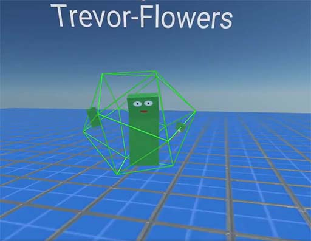

# DIVE VR-esque digital bodies

In the early 90s the Distributed Interactive Virtual Environment (DIVE) group at the Swedish Institute of Computer Science created a networked VR system with digital bodies and spaces. The paper "A Spatial Model of Interaction in Large Virtual Environments" (Benford et al) includes several images of DIVE's geometrically simple digital bodies.

Trevor used Blender to create and publish art files for bodies similar DIVE's but for use in [Mozilla Hubs](https://hubs.mozilla.com/). Here's a [video of Trevor dancing while wearing the body](https://twitter.com/TrevorFSmith/status/1146889064877920256), for some unknown reason.

To use the green body (shown above) in Hubs, browse to a Hubs room and choose "Set Name and Avatar" -> "Browse Avatars" -> click the "Avatar GLB" link and then paste in this URL:

	https://github.com/Transmutable/open-licensed-art/blob/master/Trevor%20Flowers/Swedish-Blocky-Body/Swedish-Blocky-Body.glb?raw=true

If you'd like to make your own Hubs bodies then check out [this repo from the Hubs team](https://github.com/MozillaReality/hubs-avatar-pipelines) which contains templates for various modeling apps as well as instructions.

The files in this repo directory are free to use under [this license](LICENSE.md). Other directories have their own license files.